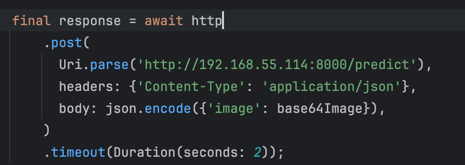

## ✅ Requirements

- Python 3.12 atau lebih baru
- Pip
- Virtualenv

---

## 🚀 Cara Menjalankan API

### 1. Clone Repo

```bash
git clone https://github.com/gerinsp/karate-classification-api.git
cd karate-classification-api
```

### 2. Buat Virtual Environment 

```bash
python -m venv venv
source venv/bin/activate  # Linux/macOS
venv\Scripts\activate     # Windows
```

### 3. Install Dependencies

```bash
pip install -r requirements.txt
```

### 4. Jalankan API

```bash
uvicorn main_holistic:app --host 0.0.0.0 --port 8000
```


atau jika ingin test menggunakan app flutter bisa menjalankan

```shell
uvicorn main_holistic:app --host 0.0.0.0 --port 8000
```

kemudian buka browser di hp pastikan di jaringan yang sama, buka alamat ip:port, contoh:

```shell
http://192.168.55.114:8000
``` 

Jika sukses maka akan muncul


Setelah itu, copy alamat url dan paste di code flutter nya di bagian


Jika ingin test menggunakan script python bisa menjalankan

```shell
python test_api.py
```

pastikan url diganti terlebih dahulu
